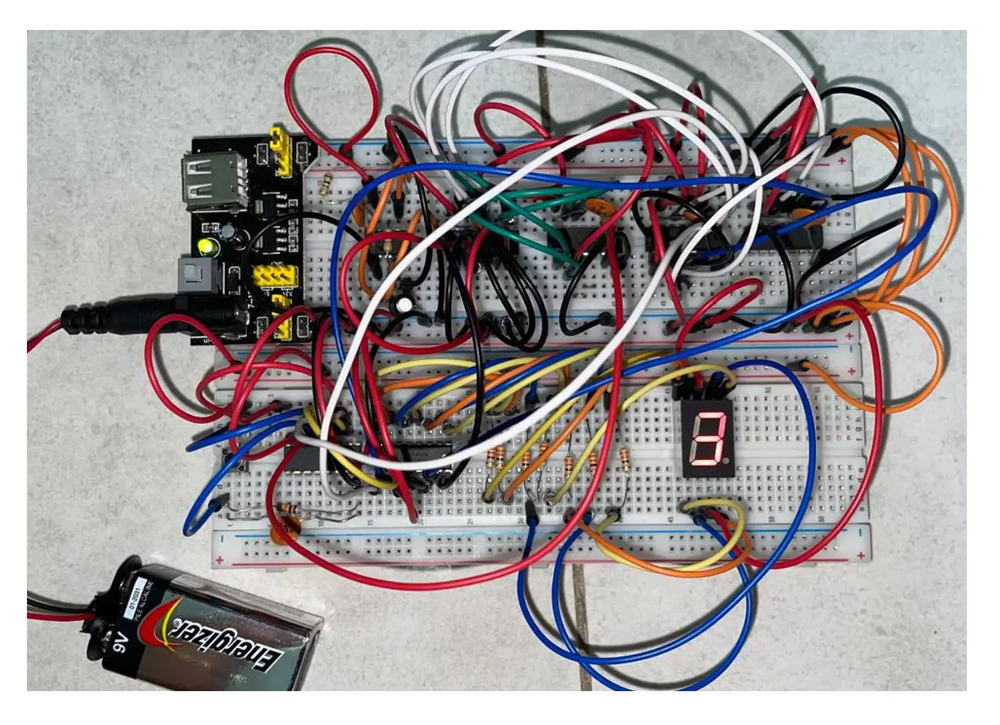
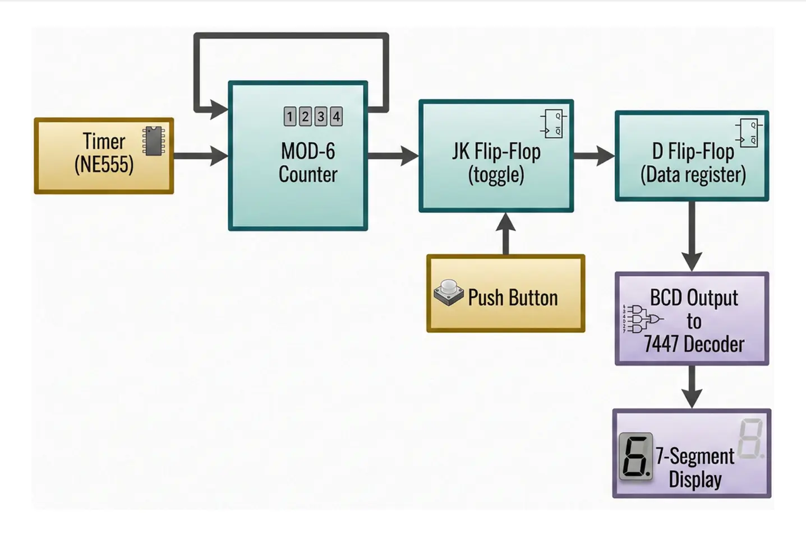
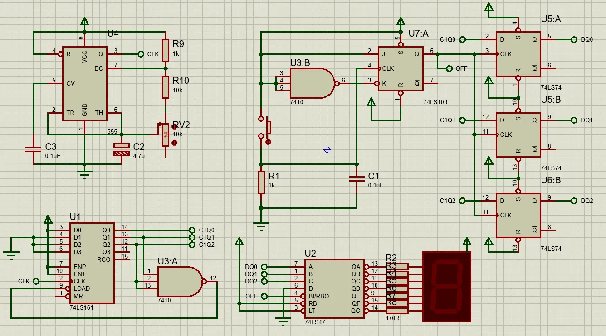
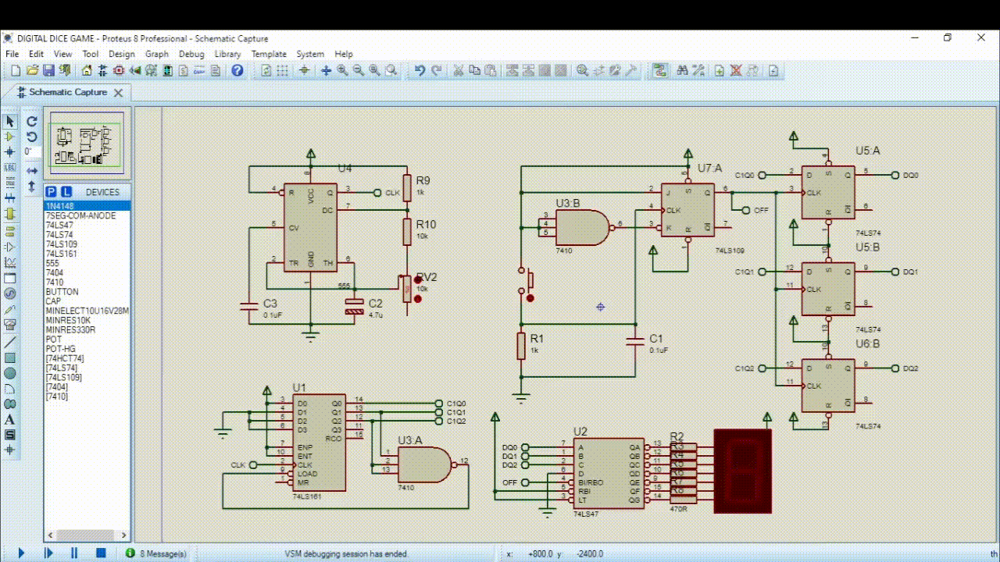

**🎲 NMK10803 Digital Systems Mini-Project: Digital Dice System**

## 📑 Table of Contents
* [Project Overview](#overview)
* [Technical Architecture](#architecture)
* [Design Constraints & Hardware Troubleshooting](#troubleshooting)
* [Conclusion](#conclusion)
* [How to Run the Simulation](#simulation)

## 📖 Project Overview
This repository details the design and implementation of a Digital Dice System, developed as part of the Digital Systems (NMK10803) undergraduate course.

While the project was selected from a predefined list of options of Mini Project, it was specifically chosen for its comprehensive architectural requirements. The design of this digital dice successfully integrates nearly all core syllabus topics, including:

`Clock Generation` (NE555 Timer)

`Sequential Logic` (Latches and Flip-Flops)

`Combinational Logic` (Decoders and Display Control)

`Finite State Machines` (Moore FSM)

  
Click here to view Circuit Overview

  

[⬆️ Back to Table of Contents](#toc)

## 🏗️ Technical Architecture

The system is built entirely from fundamental logic gates without the use of microcontrollers or programmable logic.
The architecture consists of the following stages:

  
Click here to view Design Process

  

  
Click here to view Schematic

  

`⏱️ Clock Generation (NE555 Timer):`
Configured in astable mode to produce a continuous clock signal. Based on potentiometer adjustments, the operational frequency is calculated to run between 7.5 Hz (maximum resistance) and 14.6 Hz (minimum resistance).

`🎛️ Control Logic (74LS109 JK Flip-Flop):`
Utilized to manage the clock holding and releasing mechanism. Triggered by an active-high push button, it toggles the state to simulate the "rolling" action.

`🔄 Counting and State Management (74LS161 Counter):`
A synchronous counter configured for Modulus-6 with a load of 1 to accurately represent a six-sided die.

`💾 Data Capture (74LS74 D Flip-Flop):`
Acts as a data register. Upon detecting a rising edge from the JK output, the current counter value is latched into the register to hold the final "rolled" value.

`💡 Output Display (74LS47 Decoder):`
Converts the binary data from the register into a BCD format to drive a common anode 7-segment LED display.

[⬆️ Back to Table of Contents](#toc)

## ⚠️ Design Constraints & Hardware Troubleshooting
Transitioning this design from a theoretical schematic to a physical breadboard required navigating several engineering constraints:

*🎯 Scope Management:*
To align with SMART (Specific, Measurable, Attainable, Realistic, Time-bound) criteria and the fundamental nature of the course, the scope was reviewed and refined to this state-based digital dice system.

*📦 Resource Allocation:*
To optimize mini project finances and logistics, the circuit was designed strictly around existing components provided by the university lab, eliminating the need for remote component procurement and extra expenses.

*🔧 Hardware vs. Simulation Discrepancies:*
While Proteus simulations provided a baseline, physical implementation required real-time adjustments. This included troubleshooting debouncing issues, managing power delivery across multiple ICs, and adapting truth tables to accommodate the physical availability of specific logic gates (e.g., substituting NAND/inverters).

[⬆️ Back to Table of Contents](#toc)

## 🎓 Conclusion
Drafting this circuit from zero established a strong foundational understanding of digital hardware integration. Successfully mitigating physical hardware constraints and component limitations led to a comprehensive understanding of the circuit's behavior, resulting in a confident and clear project presentation.

[⬆️ Back to Table of Contents](#toc)

## 🚀 How to Run the Simulation
Testing this circuit is incredibly straightforward. No messy source folders required!

1. Download or clone this repository to your local machine.
2. Open the `.pdsprj` file using `Proteus 8.13` (or a newer version).
3. Click the `Play (▶)` button at the bottom left of the Proteus interface to start the simulation.
4. Click the interactive push-button in the schematic to "roll" the dice and watch the logic gates in action!

  
Click here to view Simulation

  

[⬆️ Back to Table of Contents](#toc)
